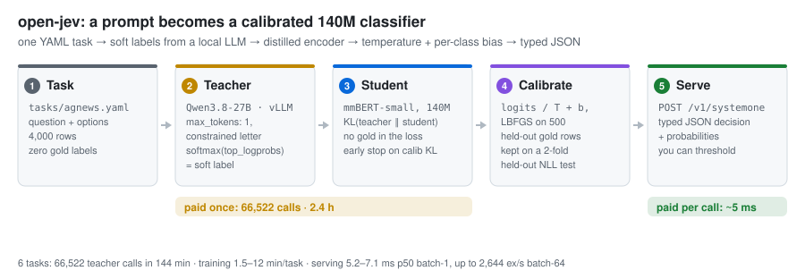
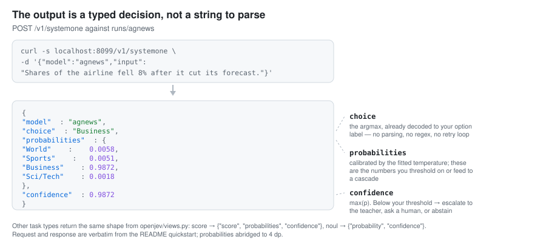
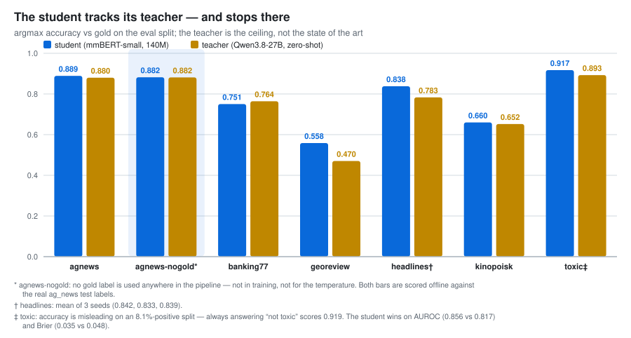

# open-jev

*[In English](README.md)*

<picture>
  <source media="(prefers-color-scheme: dark)" srcset="docs/img/pipeline-dark.svg">
  
</picture>

Превращает промпт в маленький, быстрый и откалиброванный классификатор. Вы описываете решение в
одном YAML-файле — выбор из вариантов, оценка по рубрике или истинность утверждения, — а `openjev`
заставляет локального LLM-учителя разметить несколько тысяч примеров *мягкими* метками (softmax по
логпробам одного ограниченного токена-буквы), дистиллирует их в энкодер на ~140M параметров,
калибрует его на отложенной выборке и отдаёт результат по `POST /v1/systemone` как типизированное
решение с вероятностями, по которым можно ставить порог. Это открытая реализация идеи, стоящей за
Jev от TypeSafe. Jev — закрытый хостинговый API, чьи заявленные цифры снаружи проверить нельзя,
поэтому здесь они не повторяются: каждое число в этом репозитории получено кодом из этого
репозитория.

**Задача** (YAML) → **учитель** (одна ограниченная буква на пример) → **ученик** (`mmBERT-small`,
обучение на `KL(teacher ‖ student)`) → **калибровка** (`logits / T + b` на 500 отложенных строках) →
**сервинг**. Всё складывается в `runs/<task>/`. Стадии подробно и точный запрос к учителю:
[`docs/pipeline.md`](docs/pipeline.md). Справочник по YAML и как завести свою задачу:
[`docs/task-spec.md`](docs/task-spec.md).

<picture>
  <source media="(prefers-color-scheme: dark)" srcset="docs/img/response-card-dark.svg">
  
</picture>

## Быстрый старт

```bash
uv venv && uv pip install -e . && . .venv/bin/activate   # ./.venv; python -m venv .venv тоже подойдёт
cp tasks/example.yaml tasks/mytask.yaml                  # своя задача: поправьте question, options, data.source
OPENJEV_TEACHER_URL=http://localhost:8000/v1 openjev run tasks/agnews.yaml   # label -> train -> calibrate -> eval
openjev serve runs/agnews --port 8099                    # блокируется; curl — из другой оболочки
curl -s localhost:8099/v1/systemone -H 'Content-Type: application/json' \
  -d '{"model":"agnews","input":"Shares of the airline fell 8% after it cut its full-year profit forecast."}'
```

Последняя строка против `runs/agnews` печатает:

```json
{"model":"agnews","choice":"Business","probabilities":{"World":0.005825810134410858,
 "Sports":0.005110130645334721,"Business":0.9872164130210876,"Sci/Tech":0.0018476743716746569},
 "confidence":0.9872164130210876}
```



Каждая обслуживаемая модель — один обученный ученик с фиксированным типом и фиксированным набором
меток, а не универсальная модель, принимающая варианты в запросе; `GET /v1/models` перечисляет
загруженные. Батчи, флаг эскалации, конформные множества предсказаний и `openjev push`:
[`docs/serving.md`](docs/serving.md).

Запускайте всё из корня репозитория. `pytest -q tests` проходит меньше чем за минуту на CPU, без
GPU и без учителя (двум тестам нужны `jhu-clsp/mmBERT-small` и `fancyzhx/ag_news` в кэше Hugging
Face). Задачи здесь английские и русские; ничего языкозависимого в коде нет.

## Результаты

<picture>
  <source media="(prefers-color-scheme: dark)" srcset="docs/img/student-vs-teacher-dark.svg">
  
</picture>

Таблицу результатов перегенерирует `openjev report` из `results/*.json`, и пишет он только в
`README.md`, поэтому она живёт в одном экземпляре — в английском README:
**[таблица результатов](README.md#results)** (задача, тип, K, язык, n_train, acc/F1 ученика и
учителя, согласие, ECE raw→cal, Brier, p50 на GPU, ex/s, плюс построчные примечания).

Учитель во всех строках — **Qwen3.8-27B** zero-shot, модель, описанная в разделе
[Требования](#требования), вызовы с `max_tokens: 1` и `enable_thinking: false`. Ученики не могут
обойти её иначе, чем убрав из неё шум. Что означает каждая колонка и чего она не означает:
[`docs/findings.md#what-the-numbers-mean`](docs/findings.md#what-the-numbers-mean).

## Что мы выяснили

Каждая разница — парный бутстрап по общим строкам eval (`openjev compare`, 2000 пересэмплирований),
три сида везде, где меняется фактор обучения; если 95 % доверительный интервал накрывает 0, это
записано как *нет измеримой разницы*, а не как выигрыш. Разбор с каждым интервалом —
[`docs/findings.md`](docs/findings.md), таблицы и команды — [`docs/experiments.md`](docs/experiments.md).

- **500 золотых меток дают больше как поклассовый сдвиг при калибровке, чем как обучающий сигнал.**
  `logits / T + b`, подогнанный на калибровочной выборке из 500 строк: headlines 0.767 → **0.843**,
  kinopoisk 0.609 → **0.660**, georeview MAE 0.783 → **0.609**. Секунды на CPU, без переобучения и
  без вызовов учителя. Те же 500 строк, положенные в функцию потерь, оставляют kinopoisk на 4,1
  пункта *хуже*. На agnews и banking77 сдвиг не даёт ничего — там маргинал учителя и так верный.
- **Со сдвигом два ученика обходят своего учителя, а два — догоняют его.** Основная ошибка учителя
  на трудных задачах — смещённый маргинал, а K-мерный сдвиг — ровно та поправка, которая его снимает.
- **Нужно знать свой prior.** Путь без золота (объявленный `prior:`) отстаёт меньше чем на
  полпункта — только потому, что эти бенчмарки сбалансированы по построению.
- **Лучший учитель окупается только там, где он лучше на каждом примере.** Дистилляция из Jev
  вместо Qwen выигрывает на georeview (MAE 0.555 против 0.607) и даёт *нет измеримой разницы* на
  kinopoisk, хотя Jev как учитель там на 4,2 пункта лучше: оба учителя одинаково обделяют один и
  тот же класс, и сдвиг это уже снял.
- **Две ручки, которые ни на что не повлияли**, стоило измерить их с контрольной группой: 12 эпох
  против 5 и раунд `openjev augment` (PGKD-lite). И там, и там — *нет измеримой разницы*.
- **Бюджет — это учитель.** 66 522 вызова и 2,4 часа разметки на шести задачах; ученики обучаются
  за 1,5–12 минут, а каждый пост-хок результат — секунды CPU поверх логитов, уже лежащих на диске.
- **Каскад работает офлайн и часто не нужен.** Четыре прогона из девяти достигают паритета с
  учителем при 0 % эскалации. `serve` возвращает `"escalate": true/false` и сам учителя никогда не
  вызывает.

Где метод перестаёт работать — неверный prior, ошибки на уровне отдельных примеров, дрейф, `K > 19`:
[`docs/findings.md#limitations-and-follow-ups`](docs/findings.md#limitations-and-follow-ups).

## Реальные задачи

Ещё пять задач через тот же конвейер, но на входах из работы агентов: оценить прогон веб-агента по
логу действий, выбрать элемент для клика, разметить DOM-узел полем схемы. Четыре работают, одна
падает — и это полезный результат. Числа, таблицы порогов и ограничения:
[`docs/use-cases.md`](docs/use-cases.md).

- **Вырожденный учитель всё ещё может быть полезным скорером.** В `arb-success` учитель отвечает
  *не успешно* на 99,9 % строк (в золоте успешны 26,6 %), macro-F1 0,426 — но его вероятности
  ранжируют прогоны с AUROC 0,837. Ученик: AUROC 0,843, macro-F1 0,705 ± 0,018. Однако точность по
  классу *true* — 0,56 при покрытии 80 %: это фильтр для человека, а не авто-приёмка.
- **На невиданных сайтах ученики обходят своих учителей.** `swde-field` (33 поля, 3 вызова учителя
  на строку): 0,868 acc / 0,924 macro-F1 против 0,803 / 0,876; `m2w-target` (действовать или
  спросить, по одному элементу): 0,857 acc против 0,783, AUROC 0,904, и порог отвечает на 87 %
  элементов с точностью 0,870. 6 мс на решение, 714–1054 примеров/с при батче 64.
- **`choice` — неподходящий примитив для кандидатов, своих в каждой строке.** `m2w-element`
  («какой из этих 16 кандидатов») схлопывается до 0,059 accuracy при случайном уровне 0,0625: слот
  `G` в каждой строке значит другое, и фиксированной голове нечего выучить. Ранжирование каждого
  кандидата (`m2w-target`) — та же задача, и она работает.
- **Слабый результат, так и записан:** `arb-quality` (оптимальность 1–4) MAE 0,776 против 0,809 у
  учителя — учитель едва выше случайного, а учитель здесь потолок.

Весь трек: 35 900 вызовов учителя, 118 минут разметки, три сида там, где это имело значение
(*нет измеримой разницы* между сидами на всех трёх).

## Требования

- **Учитель**: эндпоинт vLLM (или другой OpenAI-совместимый) по `OPENJEV_TEACHER_URL`, с
  поддержкой `logprobs` + `top_logprobs` и поля vLLM `structured_outputs`. Все числа здесь получены
  с Qwen3.8-27B, 3-битная квантизация GSQ (ISTA-DASLab) с MTP, поднятый vLLM на той же машине под
  идентификатором `Qwen/Qwen3.8-27B-FP8`. Подойдёт любая instruct-модель, возвращающая логпробы
  букв; она же задаёт потолок качества.
- **Одна NVIDIA GPU для обучения.** Пик mmBERT-small при батче 32: **5,5 ГБ при `max_len: 256`,
  8,9 ГБ при `max_len: 512`**; mmBERT-base — **9,9 ГБ**, что уже не помещается рядом с резидентным
  vLLM на 84 ГБ на этой машине (один прогон так и убили). `serve`, `calibrate`, `eval` и `compare`
  работают на CPU.
- **Не дайте обучению уронить учителя по OOM.** На машине с унифицированной памятью тренер и vLLM
  делят один пул, и OOM-killer хоста прибьёт процесс на 84 ГБ. Все прогоны обучения здесь идут через
  `scripts/gpu_queue.sh`: одна задача за раз под `flock`, каждая под `choom -n 1000`, чтобы killer
  выбрал тренера, и проверка памяти, которая *ждёт*, а не урезает размер батча (другой размер батча —
  это уже другой эксперимент).
- Python ≥ 3.10 и зависимости из `pyproject.toml` (torch, transformers, datasets, httpx, pyyaml,
  numpy, scikit-learn, fastapi, uvicorn); других в рантайме нет. Разрабатывалось на DGX Spark (GB10,
  20 ядер, 128 ГБ унифицированной памяти), Ubuntu 24.04, torch 2.13/cu130.
- Снимите `HTTP_PROXY`/`HTTPS_PROXY`/`ALL_PROXY`: они ломают обращения к учителю на localhost и
  замедляют скачивание с Hugging Face (сам клиент учителя ходит с `trust_env=False`).

## Документация

Вся документация в `docs/` — на английском.

- [`docs/pipeline.md`](docs/pipeline.md) — пять стадий, запрос к учителю, `openjev augment`.
- [`docs/task-spec.md`](docs/task-spec.md) — справочник по YAML задачи и по командам, разобранные примеры, как завести свою задачу.
- [`docs/serving.md`](docs/serving.md) — батчи, эскалация, множества предсказаний, `openjev push`, сравнение эндпоинтов.
- [`docs/findings.md`](docs/findings.md) — выводы с доверительными интервалами, что означают колонки, ограничения.
- [`docs/use-cases.md`](docs/use-cases.md) — пять задач на входах агентов: пороги, стоимость, провалившаяся задача.
- [`docs/experiments.md`](docs/experiments.md) — лабораторный журнал: каждое сравнение с командами и таблицами.
- [`docs/img/README.md`](docs/img/README.md) — иллюстрации и как они генерируются.

## Благодарности

Проба механизма в `openjev check --probe`, защита от возобновления под изменённым промптом или
моделью, доля промахов шортлиста, счётчик дискордантных пар в `openjev compare`, шаблон
пререгистрации и построчные показания ротации в `scripts/perm_check.py` — наши собственные
реализации идей из [r-ms/mini-jev](https://github.com/r-ms/mini-jev) (MIT, © 2026 Mikhail
Rakutko), разобранного в [`docs/mini-jev-review.md`](docs/mini-jev-review.md). Код не копировался.

## Лицензия

MIT — см. [LICENSE](LICENSE).
