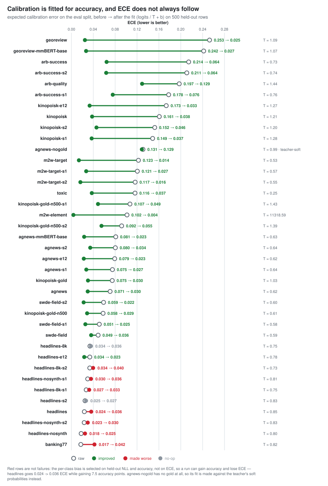
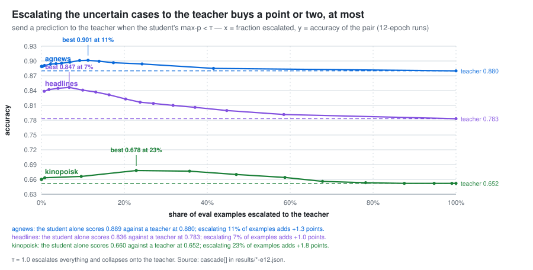
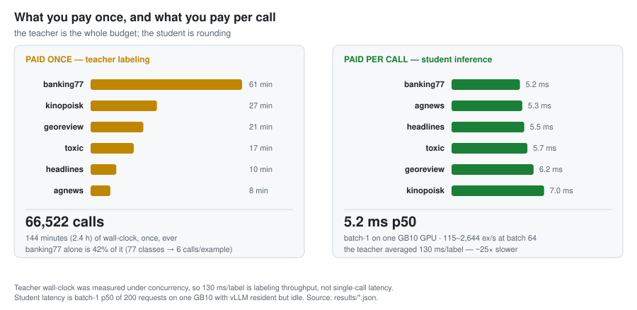

# Findings

What nine runs on one teacher actually showed, what the columns of the results table mean, and where the method stops working. The full tables, commands and bootstrap CIs behind every number here are in [`experiments.md`](experiments.md); the table itself is in the [README](../README.md#results).

Nine runs, one teacher, two nights. Every "Δ" below is a paired bootstrap (`openjev compare`, 2000
resamples) over the eval rows the two arms share; a Δ whose 95 % CI includes 0 is written as *no
measurable difference*, never as a gain. Training-side deltas (augment, more labels, where gold is
spent) are pooled over **three seeds per arm**; the epochs bullet below is the one exception and is
labelled. The post-hoc calibration deltas below are quoted at one seed per run, but the fit was
refit on all three seeds: headlines +7.0..+7.5 pts, kinopoisk +4.5..+5.1, every CI excludes 0
(R1 table in `experiments.md`). The full tables are in `experiments.md`.

<picture>
  <source media="(prefers-color-scheme: dark)" srcset="img/calibration-dark.svg">
  
</picture>

**500 gold labels are worth more as a per-class bias than as training signal.** The calibration step
fits `logits / T + b`, `b ∈ R^K` (`method: vector`), on the 500-row calib split, accepted only when
it wins a 2-fold held-out NLL test against a plain temperature. It is CPU, seconds, no teacher calls
and no retraining, and it is the largest single win in the repo: headlines 0.767 → **0.843**
(+7.5 pts, 95 % CI +6.0..+9.1), kinopoisk 0.609 → **0.660** (+5.1 pts, +2.9..+7.5), georeview MAE
0.783 → **0.609** (−0.17, −0.19..−0.16). On agnews it is +0.95 pts (CI −0.10..+1.95) and on
banking77 +0.20 (CI −1.35..+1.65) — both CIs include 0, so on those two tasks it does nothing.
toxic is excluded: its metric is AUROC, which a constant per-class shift transforms monotonically
and therefore cannot move at all, and its calib split is 2.2 % positive against 8.1 % on eval.

**With the bias, two students beat their own teacher and two match it.** headlines 0.843 vs the
teacher's 0.783 (+6.0 pts, 95 % CI +4.3..+7.7) and headlines-8k 0.8515 vs 0.783 (+6.9, +5.2..+8.6)
are measurable wins; kinopoisk 0.660 vs 0.652 (+0.8, −1.8..+3.5) and georeview MAE 0.609 vs 0.619
(−0.0095, −0.027..+0.005) are *no measurable difference* — both CIs include 0. Before it, all four
were behind. Nothing about the teacher changed — the student is distilled from
the same probabilities; the bias only removes the marginal the teacher shifted.

**Why it works: the teacher's dominant error on the hard tasks is a marginal shift, not per-example
noise.** On kinopoisk (gold is an even 33/33/33 split) the teacher answers *Good* for 56.5 % of rows
and *Neutral* for 12.7 %, and the student reproduces that faithfully. The fitted bias is
`[+0.80 Bad, +0.59 Neutral, −1.39 Good]` — it pushes down exactly the class the teacher
over-predicts and lifts the one it starves. The permutation diagnostic says how much of that is the
prompt and how much is the model: reversing the option order moves teacher accuracy 0.646 → 0.693
and its *Good* rate 0.564 → 0.418, so the Bad↔Good split is positional — but the *Neutral* collapse
survives both orders (12.9 % and 12.0 %) and averaging the two orders makes it **worse** (9.0 %),
because a class that is never the argmax in either order gains nothing from the mean. The shift is
semantic, so averaging over permutations was **not** implemented: it would double the teacher bill
to fix the part the cheap post-hoc bias already fixes for free. openjev labels each row once.

**The caveat that ships with it: you have to know your prior.** The bias above is fitted on 500 gold
rows. The no-gold variant — `prior:` declared in the YAML, gold ignored entirely (`--ignore-gold`) —
lands within half a point of it end to end: kinopoisk 0.6553, georeview MAE 0.5986. That reads like
"free debiasing with zero labels", and it is not. `uniform` is the right prior on these benchmarks
*because their eval sets are balanced by construction*; a real deployment does not get that, it gets
whatever prior it can actually declare, and a wrong declaration moves the marginal to the wrong
place. The honest claim is: **if you know your class prior you can have this without labelling
anything; if you do not, spend 500 rows from your own distribution and fit it.**

**Where to spend 500 gold labels, measured.** Same task, same seeds, same teacher labels, one factor:
500 gold rows in the CE loss (`--gold-n 500 --gold-weight 1.0`) gives kinopoisk 0.603 / 0.622 / 0.623
over three seeds; the same 500 rows used *only* to fit the calibration bias gives 0.660 / 0.654 /
0.657. Calibration wins by **Δ = +4.1 ± 1.7 pts (95 % CI +2.4..+5.7)**. Putting *all* 4000 gold
labels in the loss reaches 0.672 (one seed), i.e. 8× the labels buys 1.2 pts over the 500-row bias.
A plausible mechanism — offered as a hypothesis, not a claim — is that a few hundred hard labels
fight 4000 soft ones inside the loss, while the same rows spent post-hoc correct the one thing that
is actually broken. Two points on one task; it is not a general N-labels curve.

**More teacher labels do help, a little.** headlines at 4000 vs 8000 teacher-labeled train rows,
three seeds each, both synth-free, identical eval ids: **+1.3 pts (95 % CI +0.6..+2.1)**, 0.838 →
0.851. Doubling the teacher bill buys about a sixth of what the 500-row bias buys on the same task.

<picture>
  <source media="(prefers-color-scheme: dark)" srcset="img/cascade-dark.svg">
  
</picture>

**The cascade is offline and often unnecessary.** `eval` sweeps "student answers when confidence ≥ τ,
else the row goes to the teacher" over the probabilities we already hold — zero new teacher calls —
and writes the parity point into `openjev.json` as `escalate_below`. **Four of the nine runs reach
teacher parity at 0 % escalation**: after the bias the student already matches or beats its teacher,
so the cheapest cascade is "never escalate" (on headlines escalating actively *costs* accuracy, all
the way down to the teacher's 0.783). Where the student is behind, escalating the least confident
rows pays: banking77 0.751 → 0.776 at 27 %, kinopoisk 0.660 → 0.673 at 9 %, agnews 0.889 → 0.897 at
10 %, georeview MAE 0.609 → 0.583 at 26 %. What this may **not** claim is any saving in teacher
*quality*: escalation routes to the same zero-shot teacher that produced the training labels, scored
on the rows that teacher labelled. `serve` returns `"escalate": true/false` and never calls the
teacher itself — that call is yours.

**Two knobs that turned out not to matter.** Both were believed to work before they were measured
with a control arm:

- **Epochs: 5 vs 12 is no measurable difference** (one seed per arm — the CIs are over eval rows
  only; kept here because it decides the default). agnews Δ +0.0 ± 0.6 pts, headlines +0.7 ± 0.9,
  kinopoisk +0.0 ± 1.5 — all three CIs include 0, and the sign on headlines favours the *shorter*
  run. All three 12-epoch runs early-stop (patience 2) at 9, 7 and 5 epochs, so what `--epochs`
  really changes is the LR-decay horizon, not the training length. **The default stays 5.**
- **The augment (PGKD-lite) round on headlines is no measurable difference.** Three seeds per arm,
  the only factor being whether the 522 synthetic rows are in the training set: **Δ = +0.0 ± 0.5 pts
  (95 % CI −0.5..+0.6)**. Seed 0 showed +0.8 pts and seed 1 showed −0.9 — opposite signs on the same
  comparison. An earlier version of this README claimed a +0.5 pt gain from the round; that claim
  was one seed, exactly the size of this noise, and it is withdrawn. This does not show PGKD fails —
  one task, one round, 522 rows against 4000 — only that nothing here measured it working.

**The noise floor that every claim above is measured against.** Three seeds, identical data and
labels, only the head init and batch order changing, move accuracy 0.6–1.2 pts peak to peak: agnews
0.888 ± 0.006, headlines 0.838 ± 0.005, kinopoisk 0.657 ± 0.003. One seed is not a measurement, which
is why `compare` exists and why `report` prints an sd column.

**The student ranks better than its teacher on toxic** — AUROC 0.856 vs 0.817, Brier against the
annotator fraction 0.035 vs 0.048. Ignore the accuracy column there: the eval split is 8.1 % positive,
so always answering "not toxic" scores 0.919, above both. That win is not free either — toxic is the
one task whose training rows were drawn 50/50 *by gold* (`balance: true`), so gold paid for the row
selection even though every label is the teacher's. A plausible mechanism is that averaging 4000 soft
labels over a balanced sample denoises the teacher's per-example noise; it is one task and it did not
generalise to any other here.

**banking77 is where the teacher cost shows up.** 77 classes go through the chunked shortlist at 6
teacher calls per example: 33,000 calls for 5,500 rows, 61 minutes of teacher time, 42 % of the
night's entire teacher budget for one task. The student lands at 0.751 against the teacher's 0.764
(agreement 0.766) and the calibration bias does not move it — the shortlist's approximation survives
distillation but nothing here improves on it. This is the one task where escalation is the tool that
helps (0.776 at 27 %).

**Model size is not the bottleneck at either end.** mmBERT-base (307M vs 140M) buys agnews
0.891 vs 0.889 and georeview MAE 0.594 vs 0.609, for half the batch-64 throughput (435 vs 869 ex/s on
agnews; 115 vs 203 on georeview), 9.8–9.9 GB of training memory instead of 5.5, and 7.4 minutes of
training instead of 1–3.5 on agnews (on georeview the two took the same ~10 minutes — the box was
busy, so training time here is not a clean number). On the easy task the small student had already reached the teacher; on the
hard one it was already reproducing the teacher more faithfully than the big one — the teacher is
what was wrong, and a bias on 500 rows fixed more of it than 2.2× the parameters did.

**A task with no gold at all gets the same student.** `tasks/agnews-nogold.yaml` is `tasks/agnews.yaml`
with the `data.gold` line deleted, so nothing in the pipeline ever sees a label. Read its table row
carefully: with no gold, "teacher acc" is the teacher scored against itself (1.000 by construction)
and "student acc" 0.944 is the agreement column under another name. The number that answers "what do
you get with no labels at all" is measured offline against the real ag_news test labels:
**0.8820** against the teacher's **0.8815** on the same 2000 rows, within noise of the
gold-calibrated run. Removing gold from the loop cost nothing measurable *here* — on a task where the
teacher is strong and already well calibrated. On the hard tasks the gold-free path is the `prior:`
one above, and it is only as good as the prior you declare. (`gold_acc_offline` in
`results/variants/agnews-nogold-goldacc.json` comes from `scripts/nogold_gold_acc.py`, a hand-run
measurement outside the pipeline; it lives in `results/variants/` because `openjev eval` rewrites
`results/agnews-nogold.json` and would drop a key it did not write.)

<picture>
  <source media="(prefers-color-scheme: dark)" srcset="img/cost-dark.svg">
  
</picture>

**Teacher cost.** 66,522 teacher calls and 144 minutes (2.4 h) of labeling wall-clock across the six
tasks, of which banking77 alone is 61 minutes; headlines-8k added 4,434 rows in 9 more. Student
training is 1.5–12 minutes per task, and every post-hoc result above — the bias, the prior variant,
the cascade curves — is CPU seconds on logits already on disk. The teacher is the budget; everything
else is rounding.

## A better teacher, distilled: Jev's labels against our Qwen teacher's

The head-to-head above scored the two *teachers*. This section swaps the teacher inside the pipeline
and measures the *students*, on the two tasks where the teacher gap was real: georeview and
kinopoisk. Both arms share the task YAML, the split ids, the texts, the eval rows, the student
checkpoint (`jhu-clsp/mmBERT-small`), `max_len`, `lr`, `batch_size`, epochs, the early-stopping rule
and the calibration method-selection rule. The only factor that varies is who produced the training
labels. Three seeds per arm, `openjev compare` over the 2000 (georeview) / 1500 (kinopoisk) shared
eval rows.

Labeling the two remaining splits cost **$0.1966** for 9000 rows at 23 ex/s and 0 failures
($0.0617 georeview, $0.1348 kinopoisk; $0.313 including the eval rows the head-to-head already
paid for). Training was 8 queue jobs, 5–7 minutes each.

| task | metric | n | Qwen teacher | Qwen student | Jev teacher | Jev student |
|---|---|---|---|---|---|---|
| georeview | mae ↓ | 2000 | 0.619 | 0.607 ± 0.003 | **0.502** | 0.555 ± 0.002 |
| kinopoisk | acc ↑ | 1500 | 0.652 | 0.657 ± 0.003 | **0.694** | 0.659 ± 0.003 |

Students are the mean over three seeds ± sd; teachers are their own `teacher.jsonl` eval rows.
Same rows, same gold, same metric code (`results/api/jev-student.json`, from
`scripts/jev_student_report.py`).

**Only one of the two teacher wins survives distillation.** On georeview the Jev-distilled student
is better: **Δ MAE = −0.052 ± 0.010 (95 % CI −0.062..−0.042)**, consistent across all three seeds
(−0.056, −0.048, −0.051). On kinopoisk there is **no measurable difference**: Δ = +0.2 ± 1.2 pts
(95 % CI −1.0..+1.4), with the seeds straddling zero (−0.13, +0.27, +0.53 pts). The teacher was
4.2 points better and none of it reached the student.

**Why: the 500-gold calibration bias had already bought what the better teacher offers.** Before
calibration the Jev student wins on *both* tasks — georeview MAE −0.111 (CI −0.135..−0.085),
kinopoisk **+4.7 pts** (CI +3.0..+6.3), which is the teacher gap almost exactly. The vector fit then
lifts the Qwen student by 4.9 pts on kinopoisk and the Jev student by 0.5, and they meet:

| task | arm | uncalibrated | calibrated |
|---|---|---|---|
| georeview (mae ↓) | Qwen student | 0.674 | 0.607 |
| georeview (mae ↓) | Jev student | 0.564 | 0.555 |
| kinopoisk (acc ↑) | Qwen student | 0.608 | 0.657 |
| kinopoisk (acc ↑) | Jev student | 0.654 | 0.659 |

On kinopoisk the two teachers fail the same way — both starve *Neutral* (Qwen 12.7 %, Jev 7.7 %,
against a gold 33.3 %) and split the rest between *Bad* and *Good* (Qwen 30.7/56.5, Jev 43.4/48.9).
That is a marginal shift, and a per-class bias fitted on 500 gold rows removes a marginal shift
whoever caused it. Paying a better teacher to fix it is paying for something 500 labels and a
few CPU seconds already fix. georeview is the case where the better teacher is better *per example*
— its MAE gap is 0.117 and about 45 % of it (0.052) survives into the student — and there the money
buys something the bias cannot.

**Near-hard labels change what the calibration step has to do, not which method it picks.** Jev's
probabilities are rounded to 0.01 and frequently a single spike: on the training splits,
17.6 % of georeview rows and **60.3 % of kinopoisk rows** carry a max probability above 0.999, against
0.0 % for both Qwen splits (mean label entropy 0.38 vs 0.75 and 0.17 vs 0.49). All six arms still
selected `method: vector` and the 2-fold held-out NLL test accepted it in every one. What moved is
the temperature: the Jev students come out badly overconfident and need roughly twice the
temperature to fix — georeview T = 1.78/2.06/2.03 against 1.09/1.09/1.09, kinopoisk
T = 2.19/2.26/2.20 against 1.21/1.28/1.20. Calibrated ECE lands in the same place either way
(georeview 0.029–0.057 vs 0.035–0.062; kinopoisk 0.042–0.054 vs 0.041–0.060), so the spikiness cost
nothing here — but only because a calibration step was there to undo it. Distilling Jev's labels
*without* the calibration step would ship a student whose confidence is worth less than our
softer teacher's.

**Training on near-hard targets is measurably harder to fit, and it did not hurt.** The KL floor is
roughly double: best calib KL 0.32 vs 0.13 (georeview) and 0.22 vs 0.11 (kinopoisk), with the
training-loss floor 0.047 vs 0.021 and 0.037 vs 0.018. georeview's Jev arm early-stopped at epoch 2
instead of 4. Argmax agreement with its own teacher is unchanged (georeview 0.647 vs 0.649,
kinopoisk 0.702 vs 0.693) while mean KL to the teacher is higher (0.49 vs 0.33, 0.48 vs 0.39) —
the student copies the spiky teacher's *decisions* as faithfully as the smooth one's and its
*distribution* less faithfully, which is the expected shape and did not cost accuracy on either
task.

**What makes this comparison honest, and what limits it.** Honest: everything except the labels is
identical — same YAML, same split ids, same texts, same eval rows and gold, same student, same
hyperparameters, same calibration rule, three seeds per arm, paired bootstrap over the shared rows.
Limiting: Jev is a closed hosted model, so nothing here explains *why* it is better and the result
is not reproducible from weights; its probabilities are quantised to 0.01, which is a property of the
API and not of the model, so the softness comparison is a comparison with a rounded teacher rather
than a hard one; and two tasks, both Russian, both ordinal-ish, is two tasks. The one arm where
the head-to-head said Jev ranks *worse* than our student (arb-success, AUROC 0.822 vs 0.843) was
not distilled here, so nothing below says what a worse-but-softer teacher does to a student.

## What the numbers mean

- **The student sees zero gold labels.** `gold_weight` is 0 by default, so training uses only the
  teacher's distributions. Gold is used for the eval and (when present) for fitting the temperature.
  One exception: **toxic** sets `balance: true` on its training split, which picks 50/50 rows *by gold*
  from an 8%-positive dataset. Its labels are still the teacher's, but the row selection spent gold, so
  it is not a zero-gold row; every other task is. That balanced draw also came out of the same 60k-row
  pool as calib, and it went first, so toxic's calib split ended up **11/500 = 2.2% positive against
  8.1% on eval** — T = 0.25 was fitted on 11 positives. It still cut eval ECE 0.116 → 0.037, but it is
  a temperature fitted under the wrong prior on very few rows, not a clean result. The sampler now
  draws the natural-rate splits before any balanced one; the numbers in the table predate that fix.
- **The baseline is the teacher, not the state of the art.** Teacher zero-shot accuracy on the same
  eval split is in the table beside the student's. The claim being tested is "a 140M encoder can keep
  the teacher's accuracy at a fraction of the cost", not "this beats a supervised model".
- **ECE** is expected calibration error: max-probability bucketed into 15 equal-width bins, mean over
  bins of |mean confidence − accuracy|, weighted by bin mass. `raw→cal` is before and after
  calibration (temperature, or temperature plus the per-class bias — `calib.json` says which).
  Lower is better; it is a summary, not a guarantee about any single prediction, and where the two
  disagree the task's own metric is the headline, never ECE: a bias that fixes a shifted marginal
  can raise ECE on the calib split while raising accuracy by 7 points.
- **Brier** is the multiclass sum-of-squares against the one-hot gold, on calibrated probabilities.
- **agree** is argmax agreement between student and teacher on the eval split. It is the metric that
  matters when a task has no gold at all.
- **Latency** is batch-1 on the GB10 GPU, p50 of 200 requests after 20 warmups. Every row in the table
  was measured with vLLM resident but **idle**, so the rows are comparable to each other; a box without
  the teacher loaded at all would be a little faster still. `ex/s` is batch-64 throughput on the same
  hardware. `results/*.json` also carries a CPU batch-1 p50.
- **Distillation cannot beat its teacher's *systematic* errors.** Where the teacher is consistently
  wrong the student inherits it, and the agreement column tells you how much. Independent per-example
  noise is the one thing averaging can wash out — that is the most it did on toxic.

## Limitations and follow-ups

- **The calibration bias needs a prior you actually know.** `method: vector` fits a per-class bias on
  ~500 gold rows *from the deployment distribution*; the no-gold path needs a `prior:` you declare.
  Every benchmark here is balanced by construction, so `uniform` happens to be correct — that is a
  property of the benchmarks, not a property of the method. A wrong prior moves the marginal to the
  wrong place, and fewer than ~500 calib rows makes the fit noise. Fit it on rows drawn at the same
  rate as the traffic you will serve: toxic is the cautionary example (calib 2.2 % positive against
  8.1 % on eval, because a balanced train draw went first and depleted the pool).
- **A per-class bias cannot fix a per-example error.** It removes a marginal shift and nothing else:
  on agnews and banking77, where the teacher's marginal is already right, it buys nothing, and on a
  two-class AUROC task (toxic) it cannot move the metric at all.
- **The cascade is measured against the teacher that made the labels.** `escalate_below` and the
  curves in `results/*.json` route the unsure rows back to the same zero-shot teacher that produced
  the training labels, scored on the rows it labelled. That is a cost/latency trade-off, not evidence
  of any gain in answer quality, and it says nothing about escalating to a *better* model.
- **Option position bias is measured, not fixed.** Reversing the option order moves the teacher's
  *Good* rate on kinopoisk from 56.4 % to 41.9 % (gold 33.4 %) and its accuracy from 0.646 to 0.693 —
  but the *Neutral* collapse survives both orders (12.9 % and 12.0 % against a gold 33.7 %), and
  averaging the two orders makes it worse (9.0 %). The bias is semantic, not positional, so openjev
  labels each row once and removes the marginal shift post-hoc with the calibration bias instead — on
  kinopoisk that is `[+0.80 Bad, +0.59 Neutral, −1.39 Good]`, fitted on 500 calib rows, for zero extra
  teacher calls. Picking the better order would itself need gold, and headlines goes the other way
  (0.784 original vs 0.768 reversed).
- **K > 19 is approximate.** `top_logprobs` caps at 20, so large label sets go through a chunked
  shortlist: softness is exact only within the shortlist, and if every chunk misses the true class
  the label is simply wrong. Cost is `ceil(K/19) + 1` calls per example.
- **No ONNX / quantized export.** `serve` runs the PyTorch model; the export bundle is
  `student/` + `openjev.json` (+ `conformal.json`), which is what `openjev push` uploads.
- **No recalibration under drift.** One `T` and one `b` per task, fitted once. Nothing here detects
  that the deployment prior has moved, which is exactly the failure mode the bias is sensitive to.
- **Calibration target depends on the data.** With gold on the calib split the fit targets gold;
  without it, the temperature targets the teacher's *soft* probabilities and the bias targets the
  declared `prior:` — which calibrates the student to the teacher's opinion plus your belief, not to
  the truth. `calib_target` in `results/*.json` says which path ran.
- **The teacher is the cost.** Labeling dominates wall-clock; the student trains in minutes and every
  post-hoc step is CPU seconds.
