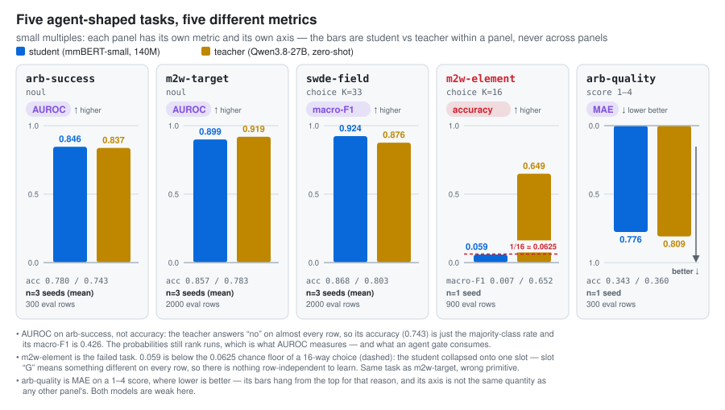

# Real tasks: agent-shaped decisions

The seven tasks in the [results table](../README.md#results) measure the method on benchmarks. This
page asks whether the same YAML-to-server loop survives inputs that look like the work an agent
stack actually does — a web-agent run to judge, an element to click, a DOM node to label. Five
tasks, the unchanged pipeline (`tasks/<t>.yaml` → `check` → `run`), the same zero-shot Qwen3.8-27B
teacher as everywhere else.

<picture>
  <source media="(prefers-color-scheme: dark)" srcset="img/use-cases-dark.svg">
  
</picture>

*One panel per task, each with its own metric and axis — AUROC, macro-F1, accuracy and MAE are not
comparable, so they never share a scale. Regenerate with `python docs/img/make_figures.py`.*

| task | type | what it decides | student | teacher | verdict |
|---|---|---|---|---|---|
| `arb-success` | noul | did this web-agent run succeed? | AUROC **0.843** | 0.837 | works as a *ranker*, not as an auto-accept |
| `m2w-target` | noul | is this element the next action target? | acc **0.863**, AUROC 0.904 | 0.783 / 0.919 | works |
| `swde-field` | choice (33) | which schema field is this DOM node? | acc **0.864**, macro-F1 0.917 | 0.803 / 0.876 | works, unseen websites |
| `arb-quality` | score (1–4) | how optimal was the run? | MAE **0.776** | 0.809 | weak — the teacher is barely above chance |
| `m2w-element` | choice (16) | which of these 16 candidates? | acc **0.059** | 0.649 | **fails** — wrong primitive |

Numbers on this page are seed 0; the results table carries the three-seed means. Every "no
measurable difference" is `openjev compare` over the eval rows two seeds share (the rule and the
column meanings: [`findings.md`](findings.md)). Four of the five work. One fails, and the failure
is the most transferable thing here: it says which primitive fits which problem.

---

## `arb-success` — "did this run succeed?" (noul, 1290 annotated runs)

Source: [AgentRewardBench](https://huggingface.co/datasets/McGill-NLP/agent-reward-bench). Each row
is one web-agent trajectory rendered as a short action log — never the pages, never a screenshot:

```
goal: Order an Apple Watch from the service catalog ... order 5 "Apple Watch"
steps: 7
1. [dev275972.service-now.com] click('79')
...
7. send_msg_to_user("I have successfully completed the task of ordering 5 Apple Watches ...")
final: ... The order has been submitted with request number REQ0010278. The total cost is $1,749.95
```

The product is the probability, not the argmax:

```python
r = httpx.post(f"{OPENJEV}/v1/systemone", json={"model": "arb-success", "input": action_log}).json()
send_to_human_review = r["probability"] < 0.65          # {"probability": 0.31, "confidence": 0.69}
```

**The teacher is degenerate and the calibration bias fixes it.** The teacher answers *no* for
**1249 of 1250 rows** (99.9 %) against a 26.6 % gold success rate: argmax accuracy 0.743 is exactly
the majority-class rate, macro-F1 **0.426**. But its *probabilities* still rank runs: teacher AUROC
**0.837**. That is the point of reading logprobs instead of a string — a model whose argmax is
useless can still be a usable scorer. The fitted vector calibration is `b = [+1.93 true, −1.93 false]`,
almost two logits of pure marginal shift, and after it the student's ECE is 0.214 → **0.064**.

| seed | acc | macro-F1 | AUROC | ECE raw→cal |
|---|---|---|---|---|
| 0 | 0.770 | 0.695 | 0.843 | 0.214→0.064 |
| 1 | 0.773 | 0.695 | 0.843 | 0.178→0.076 |
| 2 | 0.797 | 0.725 | 0.851 | 0.211→0.064 |
| teacher | 0.743 | 0.426 | 0.837 | 0.203 (raw) |

`openjev compare runs/arb-success runs/arb-success-s1`: **Δ = −0.0 ± 1.8 pts (95 % CI −1.7..+1.8)**,
no measurable difference. With 300 eval rows that CI is ±1.8 pts on AUROC — read the AUROC tie with
the teacher as a tie, not as a win.

**The gate** (`selective` in `results/arb-success.json` — student answers when `confidence ≥ τ`,
everything else goes to a human):

| τ | coverage | acc on answered | precision(true) |
|---|---|---|---|
| 0.50 | 1.00 | 0.770 | 0.554 |
| 0.60 | 0.843 | 0.834 | 0.566 |
| **0.65** | **0.800** | **0.846** | **0.558** |
| 0.75 | 0.700 | 0.890 | 0.606 |
| 0.85 | 0.577 | 0.942 | 0.786 |

**0.56 precision on *true* is far too low to auto-accept a run.** At τ = 0.65 the model answers
80 % of runs at 0.846 accuracy, but of the runs it calls successful nearly half are not. No τ in
seed 0's sweep reaches 90 % precision(true); seed 1 reaches 1.00 at τ = 0.95, but that is 94
answered rows (31 % coverage) — noise, not an operating point. This student is a **filter that
cheaply clears the obvious failures and ranks the rest for a human**. What it cannot show: it
judges from the action log only, so a run that claims success in `send_msg_to_user` and did not do
it is the hard case by construction, and 300 eval rows is a small measurement.

---

## `m2w-target` — "is this the element to act on?" (noul, held-out websites)

Source: [Multimodal-Mind2Web](https://huggingface.co/datasets/osunlp/Multimodal-Mind2Web), text
columns only. One row = one `(task, element)` pair — the positive plus 3 sampled negatives:

```
task: Find tickets from Manchester Piccadilly to any station in London on April 8 ...
done: [span] London -> CLICK ; [textbox] Date use format: 16-Mar-23 -> CLICK
element: <select> role="listbox" aria_label="minutes" "00 15 30 45"
path: div > fieldset > div > div
parent text: "00 15 30 45"
```

Score every candidate independently, act on the best one if it clears the bar, otherwise ask:

```python
scored = httpx.post(f"{OPENJEV}/v1/systemone",
                    json={"model": "m2w-target", "input": [render(e) for e in candidates]}).json()
best = max(zip(candidates, scored), key=lambda c: c[1]["probability"])
click(best[0]) if best[1]["probability"] >= 0.65 else ask_the_human()
```

**Numbers** (eval = 2000 pairs from `test_website`, websites never seen in training): student acc
**0.863**, macro-F1 **0.804**, AUROC **0.904**, ECE 0.123 → **0.014**; teacher acc 0.783, macro-F1
0.562, AUROC 0.919. The student beats the teacher's argmax by 8 pts (the teacher over-predicts
*true* here too, and the bias removes it) and is a hair behind it on AUROC. Seeds 0/1/2: acc
0.863 / 0.852 / 0.855; `openjev compare runs/m2w-target runs/m2w-target-s1`: **+0.6 ± 0.7 pts
(95 % CI −0.1..+1.2)** on AUROC, no measurable difference.

| τ | coverage | acc on answered | precision(true) |
|---|---|---|---|
| 0.50 | 1.000 | 0.863 | 0.789 |
| 0.60 | 0.915 | 0.892 | 0.852 |
| **0.65** | **0.873** | **0.904** | **0.870** |
| 0.80 | 0.687 | 0.940 | 0.910 |
| 0.90 | 0.527 | 0.965 | 1.000 |

This is `m2w-element`'s problem reformulated as a per-element verdict — and it works. What it
cannot show: the negatives are *sampled uniformly* from the page's candidate list, easier than the
top-k a real ranker would hand it, and "the agent picked the right element" is not "the agent
finished the task".

---

## `m2w-element` — the one that failed, and why (choice, K = 16)

Same pages, same teacher, one reformulation: 16 candidates in the prompt as options A–P, "which
slot?". The student **collapsed onto a single slot**: eval acc **0.059** against a 0.0625 chance
floor, macro-F1 0.007, agreement with the teacher **0.133** while the teacher itself gets
**0.649**. The fitted temperature came out at 11318 — a flat distribution wearing a calibration.
Training loss fell 1.68 → 1.05 while calibration KL stayed flat at ~1.45: it learned the
*marginal* and nothing else.

**The reason is structural, not a hyperparameter.** `choice` trains one output head per option,
and a head is only learnable if its option *means the same thing on every row*. `Sports` means
Sports in row 1 and row 4000. Slot **`G`** means "a rare-books `<li>`" in one row and "a checkbox"
in the next — the gold slot index is uniform by construction, so the only row-independent signal
in the label is a uniform distribution, and that is exactly what the student learned. The teacher
does fine because it reads the option *text* at inference time; a distilled fixed-head classifier
never sees it.

**The lesson:** *picking among per-row candidates is a ranking problem, not a typed choice.*
Express it as a per-candidate score and take the max — `m2w-target` is that same task at 0.863
accuracy with a working gate. This matches how Jev's own documentation treats re-ranking: a recipe
composed over the primitives, not a primitive. Nothing in the pipeline is broken; the task YAML was
the wrong shape, `check` cannot detect that, and it cost 33 minutes of teacher time to find out.
Seed 1 was labelled and trained but not evaluated — once the cause is structural, a second seed
buys nothing.

---

## `swde-field` — web parsing on unseen websites (choice, K = 33)

Source: [SWDE](https://huggingface.co/datasets/abdo-Mansour/SWDE), 8 verticals × 10 sites. One
row = one text node with its DOM neighbourhood; the options are 32 `vertical.field` names plus
`none`:

```
title: 2011 Lexus ES 350 4dr Sdn Overview
path: div#main_container > div#left_main > div.pod_med_white > div#CrashTest > ul > li
before: "Frontal Driver:"
node: "Not Available"
after: "Frontal Passenger:"
```

This is the **K > 19 shortlist path** for real: `teacher.max_options_per_call: 19` makes it 2
chunks plus a final call — **3 teacher calls per row**, 19,500 calls for 6500 rows. The student is
a single 33-way head; the shortlist cost is paid once, at labeling time. A scraper that labels
nodes instead of maintaining per-site selectors:

```python
r = httpx.post(f"{OPENJEV}/v1/systemone", json={"model": "swde-field", "input": render(node)}).json()
record[r["choice"]] = node.text if r["confidence"] >= 0.60 else None   # else: leave it unfilled
```

**Numbers** (eval = 2000 nodes from 2 held-out sites per vertical): student acc **0.8635**,
macro-F1 **0.9165**; teacher 0.8030 / 0.8759; agreement 0.802; ECE 0.049 → 0.036. The student is
6 pts above its own teacher on unseen websites — the same marginal-shift story as headlines in
[`findings.md`](findings.md). Seeds 0/1/2: acc 0.8635 / 0.8650 / 0.8770;
`openjev compare runs/swde-field runs/swde-field-s1`: **−0.1 ± 0.9 pts (95 % CI −1.0..+0.7)**, no
measurable difference.

| τ | coverage | acc on answered |
|---|---|---|
| 0.50 | 0.978 | 0.874 |
| **0.60** | **0.936** | **0.894** |
| 0.75 | 0.856 | 0.921 |
| 0.90 | 0.684 | 0.954 |

Abstaining on the unsure **6 %** buys 3 pts of accuracy. What it cannot show: **gold here is
string-matched**, so a value that appears twice on a page counts twice and the `none` class is full
of near-misses; the ceiling is not comparable to supervised SWDE F1 numbers, which use the real
annotations.

---

## `arb-quality` — the weak one (score, 1–4)

Same 1290 runs, gold is the annotators' optimality level 1–4. Student MAE **0.776** / acc 0.343
against the teacher's **0.809** / 0.360. Both are barely above chance on four levels, and the
teacher is the ceiling — a student cannot invent a distinction its teacher does not make, only
denoise a marginal. The `selective` gate is useless: the student is never confident, coverage falls
to 0.36 already at τ = 0.50 and to 0.04 at τ = 0.60. The honest read is that *"how optimal was this
run"* is not a decision a 40-line action log supports, and no amount of distillation fixes that.

---

## What the track cost, and what it serves at

Teacher labeling from `runs/<task>/label.json` (seed reruns reuse the same `teacher.jsonl`, so this
is the whole track, not per-seed):

| task | calls | teacher minutes | train minutes | GPU p50 (b=1) | ex/s (b=64) |
|---|---|---|---|---|---|
| arb-success | 1,250 | 4.2 | 2.6 | 6.0 ms | 182 |
| arb-quality | 1,250 | 5.1 | 2.6 | – | – |
| m2w-element | 6,400 | 32.8 | 12.0 | – | – |
| m2w-target | 7,500 | 20.9 | 5.9 | 5.8 ms | 714 |
| swde-field | 19,500 | 55.3 | 4.0 | 6.2 ms | 1054 |
| **total** | **35,900** | **118.4 min (2.0 h)** | **27.1** | | |

Latency is `openjev bench` on an idle GPU; throughput is batch 64. A 140M student answering a
click-target question in 6 ms is the reason to do any of this — the teacher call it replaces is
two orders of magnitude slower and cannot be batched into an agent's inner loop.

## What none of this shows

- **The teacher reads a rendered text line, not the page.** No screenshot, no DOM, no accessibility
  tree — an element is `tag + 2 attributes + 40 characters of text`, a run is its action log. Its
  zero-shot numbers are well below supervised SOTA on these benchmarks, and the teacher is the
  ceiling; a student that matches it is the claim.
- **Gold is noisier than the benchmarks suggest.** SWDE gold is string-matched; Mind2Web negatives
  are sampled uniformly rather than mined; ARB has 13 disagreements among 106 double-annotated runs.
- **The CIs are real.** ARB eval is 300 rows → ±0.06 on AUROC; the 2000-row evals are ±1.8 pts on
  accuracy. One seed is not a measurement, which is why every claim above carries a `compare` CI.
- **None of this is end-to-end agent accuracy.** Nothing here drives a browser. `m2w-target` scores
  a candidate the caller already found; `arb-success` judges a log after the fact; `swde-field`
  labels a node someone else extracted.
- **The gates assume the human is right.** `selective` routes unsure rows to gold, and the cascade
  caveat from `findings.md` carries over: escalation goes back to the same zero-shot teacher that
  produced the labels.
